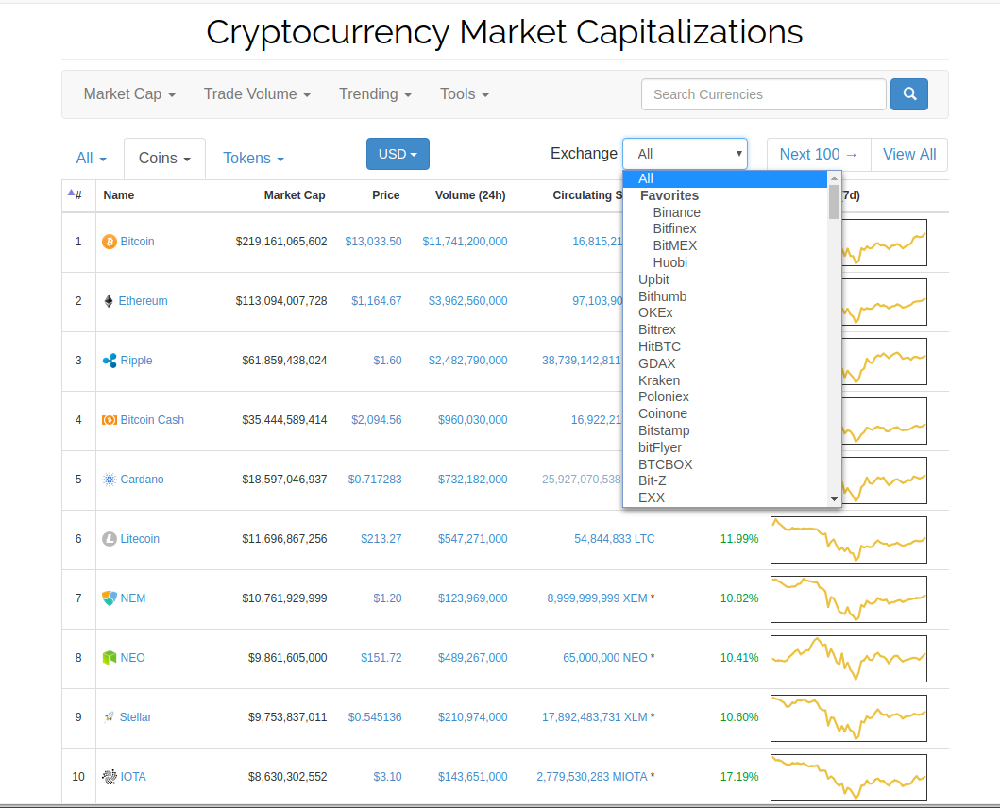
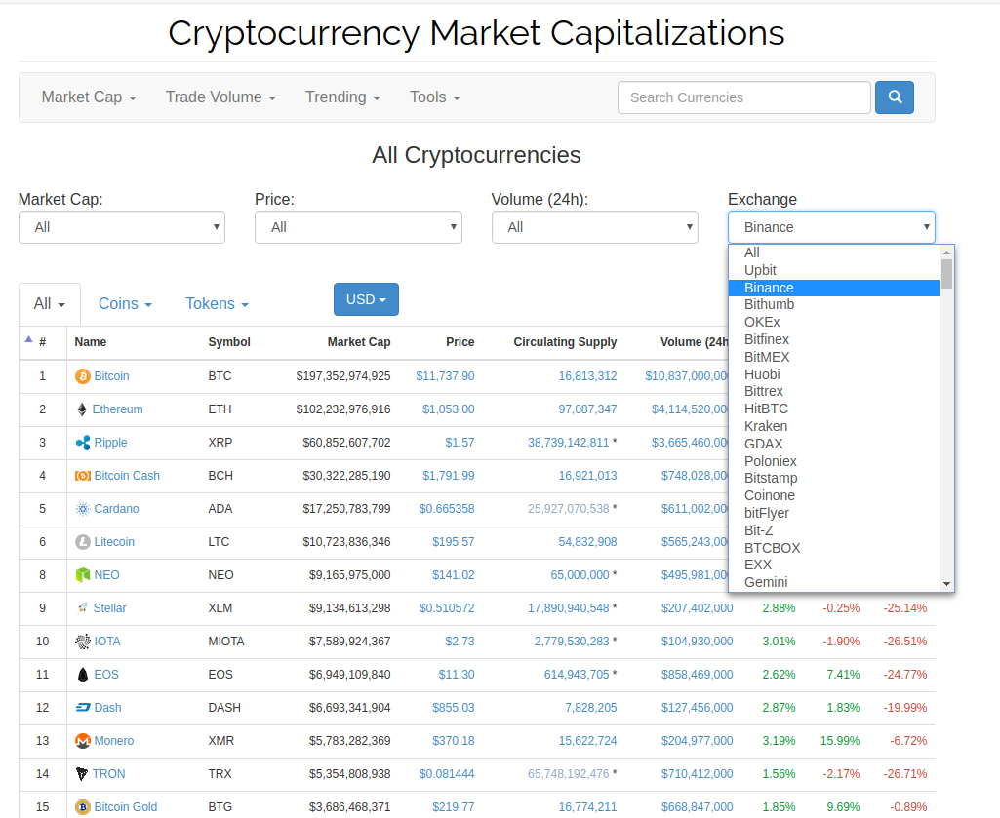
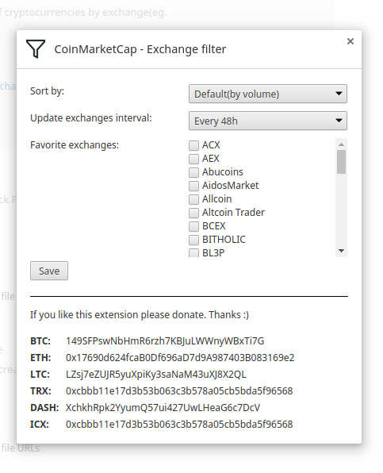

# CoinMarketCap - Filter coins/tokens by exchange
Filter lists of cryptocurrencies on CoinMarketCap.com by exchange(eg. Binance, Bitfinex, Cryptopia..)

Extension adds a dropdown to the CoinMarketCap website with a list of exchanges that CoinMarketCap tracks. When selecting an exchange in the dropdown only coins that are on that exchange will be visible in the list.

# Screenshots

**NOTE: Extension only works with the data on the page.**

**If there are 100 coins in the list it will only filter those coins. It will not add new coins to give you a new list of 100 coins**

# If you like this extension please donate. Thanks :)

**BTC:** 149SFPswNbHmR6rzh7KBJuLWWnyWBxTi7G

**ETH:** 0x17690d624fcaB0Df696aD7d9A987403B083169e2

**LTC:** LZsj7eZUJR5yuXpiKy3saNaM43uXJ8X2QL

**TRX:** 0xcbbb11e17d3b53b063c3b578a05cb5bda5f96568

**DASH:** XchkhRpk2YyumQ57ui427UwLHeaG6c7DcV

**ICX:** 0xcbbb11e17d3b53b063c3b578a05cb5bda5f96568

